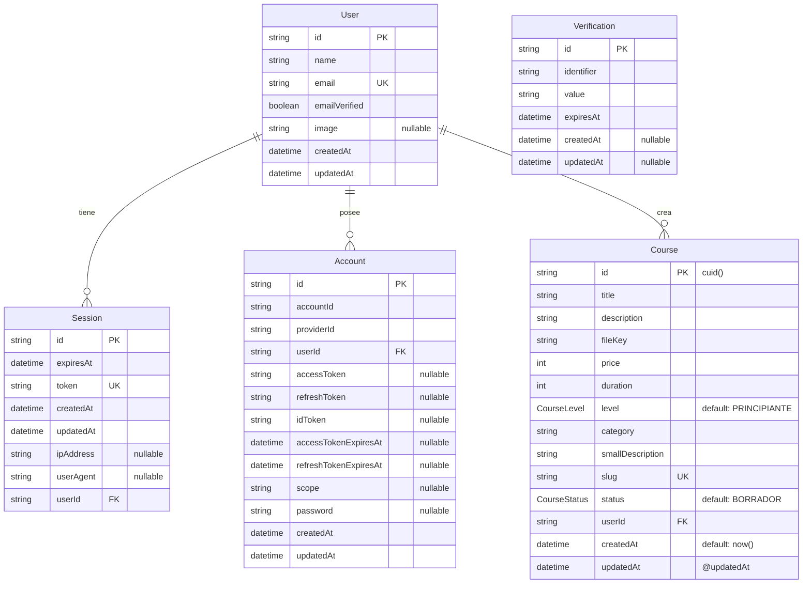

# Estructura de Base de Datos - OpenMind

## Diagrama Interactivo de la Base de Datos



## Tablas Principales

### 👤 **User** (Usuarios)
- **Propósito**: Almacena información de usuarios registrados
- **Campos clave**: 
  - `id`: Identificador único del usuario
  - `email`: Email único para autenticación
  - `emailVerified`: Estado de verificación del email
- **Relaciones**: 
  - 1:N con Sessions (sesiones de usuario)
  - 1:N con Accounts (cuentas de proveedores)
  - 1:N con Courses (cursos creados)

### 🔐 **Session** (Sesiones)
- **Propósito**: Maneja las sesiones activas de usuarios
- **Campos clave**:
  - `token`: Token único de sesión
  - `expiresAt`: Fecha de expiración
  - `ipAddress`, `userAgent`: Información de seguridad
- **Seguridad**: Cascade delete cuando se elimina el usuario

### 🔗 **Account** (Cuentas de Proveedores)
- **Propósito**: Gestiona autenticación con proveedores externos (Google, GitHub, etc.)
- **Campos clave**:
  - `providerId`: Identificador del proveedor (google, github, etc.)
  - `accessToken`, `refreshToken`: Tokens de OAuth
- **Seguridad**: Cascade delete cuando se elimina el usuario

### 📚 **Course** (Cursos)
- **Propósito**: Almacena información de cursos creados por usuarios
- **Campos clave**:
  - `slug`: URL amigable única
  - `price`: Precio en centavos
  - `level`: Nivel del curso (enum)
  - `status`: Estado de publicación (enum)
- **Enums**:
  - `CourseLevel`: PRINCIPIANTE, INTERMEDIO, AVANZADO
  - `CourseStatus`: BORRADOR, PUBLICADO, ARCHIVADO

### ✅ **Verification** (Verificaciones)
- **Propósito**: Maneja códigos de verificación (email, reset password, etc.)
- **Uso**: Tabla independiente para procesos de verificación temporal

## Índices y Restricciones

### Claves Únicas (UK)
- `User.email`: Un email por usuario
- `Session.token`: Token único por sesión
- `Course.slug`: URL única por curso

### Claves Foráneas (FK)
- `Session.userId` → `User.id`
- `Account.userId` → `User.id`
- `Course.userId` → `User.id`

### Comportamiento de Eliminación
- **Cascade Delete**: Al eliminar un usuario, se eliminan automáticamente:
  - Todas sus sesiones
  - Todas sus cuentas de proveedores
  - Todos sus cursos

## Flujo de Datos Típico

1. **Registro/Login**:
   ```
   User → Account (OAuth) → Session (token)
   ```

2. **Creación de Curso**:
   ```
   User (authenticated) → Course (BORRADOR) → Course (PUBLICADO)
   ```

3. **Verificación**:
   ```
   User → Verification (código) → User.emailVerified = true
   ```

## Consideraciones de Diseño

### ✅ Fortalezas
- Separación clara entre autenticación y datos de usuario
- Soporte para múltiples proveedores OAuth
- Sistema de estados para cursos
- Integridad referencial con cascade deletes

### 🔄 Posibles Mejoras Futuras
- Tabla de categorías separada para normalización
- Sistema de roles y permisos
- Tabla de enrollments (inscripciones)
- Tabla de reviews/ratings para cursos
- Sistema de tags para cursos

### 🛡️ Seguridad
- Tokens únicos para sesiones
- Cascade deletes para limpieza automática
- Campos nullable apropiados
- Timestamps para auditoría

---

**Generado para**: OpenMind Platform  
**Fecha**: 30 de junio de 2025  
**Versión**: 1.0