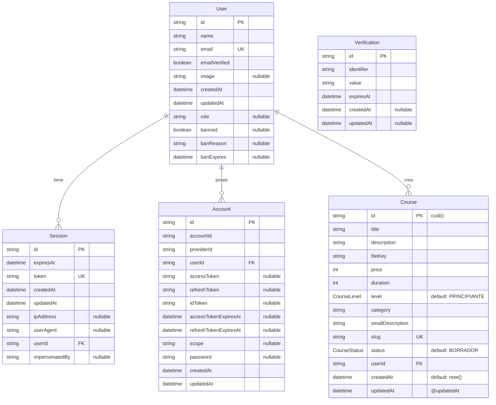

# Estructura de Base de Datos - OpenMind

## 📋 Comandos Importantes

```bash
# Configuración inicial
pnpm dlx prisma db push      # Sincronizar esquema con base de datos
pnpm dlx prisma generate     # Generar cliente de Prisma
pnpm dlx prisma studio       # Visualizar base de datos (interfaz web)

# Comandos adicionales útiles
pnpm dlx prisma migrate dev  # Crear nueva migración
pnpm dlx prisma migrate reset # Resetear base de datos
pnpm dlx prisma db seed      # Ejecutar seeds
pnpm dlx prisma format       # Formatear schema.prisma
```

## 🏗️ Diagrama Interactivo de la Base de Datos



## 📊 Tablas Principales

### 👤 **User** (Usuarios)

- **Propósito**: Almacena información de usuarios registrados
- **Campos clave**:
  - `id`: Identificador único del usuario
  - `email`: Email único para autenticación
  - `emailVerified`: Estado de verificación del email
  - `role`: Rol del usuario (admin, instructor, student)
  - `banned`: Estado de baneo del usuario
  - `banReason`: Razón del baneo
  - `banExpires`: Fecha de expiración del baneo
- **Relaciones**:
  - 1:N con Sessions (sesiones de usuario)
  - 1:N con Accounts (cuentas de proveedores)
  - 1:N con Courses (cursos creados)

### 🔐 **Session** (Sesiones)

- **Propósito**: Maneja las sesiones activas de usuarios
- **Campos clave**:
  - `token`: Token único de sesión
  - `expiresAt`: Fecha de expiración
  - `ipAddress`, `userAgent`: Información de seguridad
  - `impersonatedBy`: Para funcionalidad de impersonación
- **Seguridad**: Cascade delete cuando se elimina el usuario

### 🔗 **Account** (Cuentas de Proveedores)

- **Propósito**: Gestiona autenticación con proveedores externos (Google, GitHub, etc.)
- **Campos clave**:
  - `providerId`: Identificador del proveedor (google, github, etc.)
  - `accessToken`, `refreshToken`: Tokens de OAuth
  - `password`: Para autenticación local
- **Seguridad**: Cascade delete cuando se elimina el usuario

### 📚 **Course** (Cursos)

- **Propósito**: Almacena información de cursos creados por usuarios
- **Campos clave**:
  - `slug`: URL amigable única
  - `price`: Precio en centavos
  - `duration`: Duración en minutos
  - `level`: Nivel del curso (enum)
  - `status`: Estado de publicación (enum)
  - `fileKey`: Clave del archivo de imagen en S3
- **Enums**:
  - `CourseLevel`: PRINCIPIANTE, INTERMEDIO, AVANZADO
  - `CourseStatus`: BORRADOR, PUBLICADO, ARCHIVADO

### ✅ **Verification** (Verificaciones)

- **Propósito**: Maneja códigos de verificación (email, reset password, etc.)
- **Uso**: Tabla independiente para procesos de verificación temporal

## 🔑 Índices y Restricciones

### Claves Únicas (UK)

- `User.email`: Un email por usuario
- `Session.token`: Token único por sesión
- `Course.slug`: URL única por curso

### Claves Foráneas (FK)

- `Session.userId` → `User.id`
- `Account.userId` → `User.id`
- `Course.userId` → `User.id`

### Comportamiento de Eliminación

- **Cascade Delete**: Al eliminar un usuario, se eliminan automáticamente:
  - Todas sus sesiones
  - Todas sus cuentas de proveedores
  - Todos sus cursos

## 🔄 Flujo de Datos Típico

1. **Registro/Login**:
   ```
   User → Account (OAuth) → Session (token)
   ```

2. **Creación de Curso**:
   ```
   User (authenticated) → Course (BORRADOR) → Course (PUBLICADO)
   ```

3. **Verificación**:
   ```
   User → Verification (código) → User.emailVerified = true
   ```

4. **Gestión de Usuarios**:
   ```
   Admin → User.banned = true → User.banReason = "reason"
   ```

## ⚙️ Configuración de Prisma

### Generator

```prisma
generator client {
  provider = "prisma-client-js"
  output   = "../lib/generated/prisma"
}
```

### Datasource

```prisma
datasource db {
  provider = "postgresql"
  url      = env("DATABASE_URL")
}
```

## 🎯 Características Avanzadas

### 🛡️ Sistema de Moderación

- **Baneos**: Campo `banned` con razón y fecha de expiración
- **Roles**: Sistema de roles flexible con campo `role`
- **Impersonación**: Funcionalidad para admins con `impersonatedBy`

### 📁 Gestión de Archivos

- **S3 Integration**: Campo `fileKey` para archivos en AWS S3
- **Slugs**: URLs amigables para SEO

### 🔄 Estados de Cursos

- **BORRADOR**: Curso en desarrollo
- **PUBLICADO**: Curso disponible públicamente
- **ARCHIVADO**: Curso retirado pero conservado

## 🚀 Consideraciones de Diseño

### ✅ Fortalezas

- Separación clara entre autenticación y datos de usuario
- Sistema de moderación robusto
- Soporte para múltiples proveedores OAuth
- Sistema de estados para cursos
- Integridad referencial con cascade deletes
- Funcionalidad de impersonación para admins

### 🔄 Posibles Mejoras Futuras

- Tabla de categorías separada para normalización
- Sistema de enrollments (inscripciones)
- Tabla de reviews/ratings para cursos
- Sistema de tags para cursos
- Tabla de lecciones/capítulos
- Sistema de notificaciones

### 🛡️ Seguridad

- Tokens únicos para sesiones
- Cascade deletes para limpieza automática
- Sistema de baneos con expiración
- Campos nullable apropiados
- Timestamps para auditoría

## 📝 Comandos de Desarrollo

```bash
# Desarrollo
pnpm dlx prisma migrate dev --name init  # Primera migración
pnpm dlx prisma migrate dev --name add_user_roles  # Migración con nombre

# Producción
pnpm dlx prisma migrate deploy  # Aplicar migraciones en producción

# Utilidades
pnpm dlx prisma db pull    # Actualizar schema desde DB existente
pnpm dlx prisma validate   # Validar schema
pnpm dlx prisma version    # Ver versión de Prisma
```

---

**Generado para**: OpenMind Platform  
**Última actualización**: `new Date().toLocaleDateString('es-ES')`  
**Versión de Prisma**: `~5.0.0`